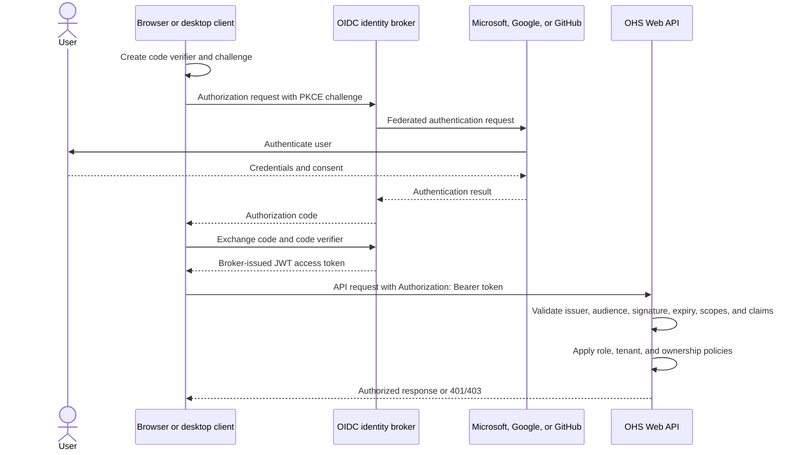
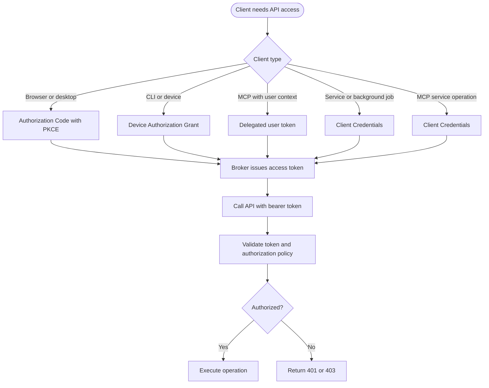
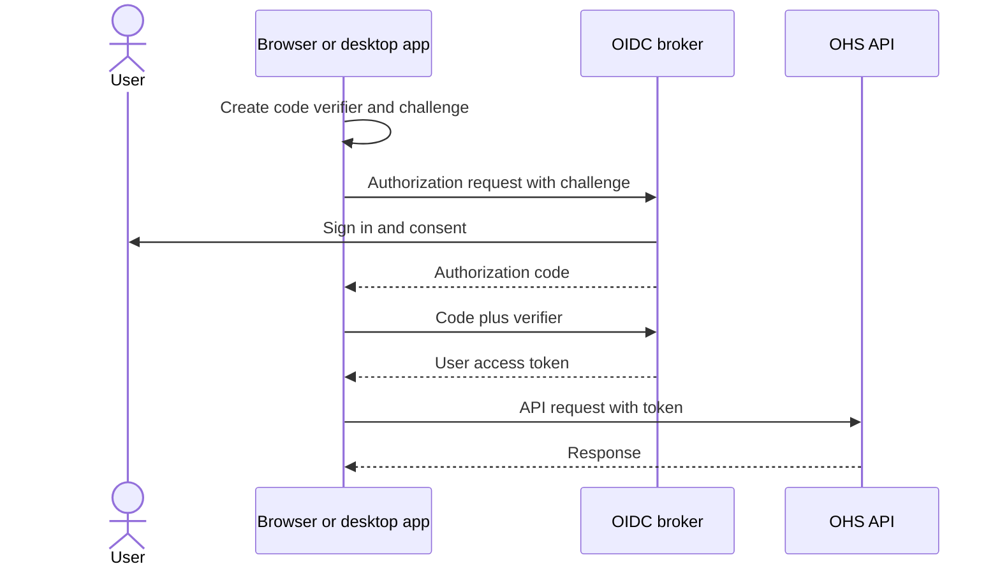
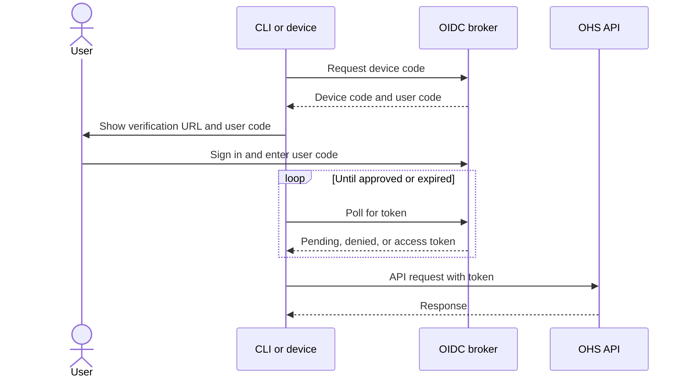
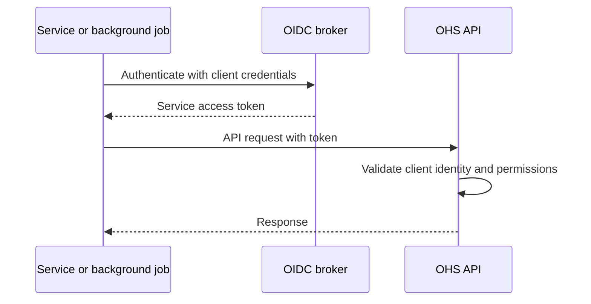
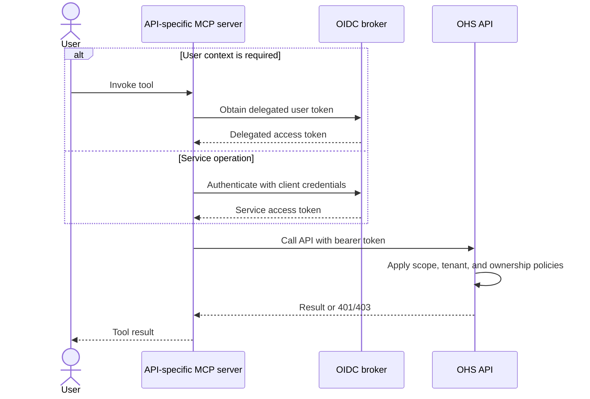

# OAuth and OIDC authentication

## Summary

- APIs do not need a web UI to use OAuth 2.0 or OpenID Connect.
- Each API is a resource server that validates broker-issued JWT access tokens.
- Use one identity broker for Microsoft, Google, and GitHub federation.
- Use Keycloak in local development and CI. Use Microsoft Entra External ID for Azure-first shared and production environments.
- Use policy-based authorization with tenant and ownership checks.
- Start with one authenticated MCP server per API.
- Do not implement an identity broker inside the APIs or services.

### API authentication

The Web API does not use an OAuth client flow. It is a resource server that validates bearer access tokens. A browser or desktop client
calling the API uses Authorization Code with PKCE to obtain the token.

<details> <summary>Details</summary>

The API validates the access token's signature, issuer, audience, expiry, scopes, and claims. A separate client handles login and token
acquisition. APIs must not implement login screens, redirects, or direct trust in Google, GitHub, or Microsoft provider tokens.

#### Browser or desktop client to Web API



The client authenticates through the broker and its configured external provider. The broker issues the token. The Web API never receives
provider credentials and never accepts provider tokens directly.

</details>

### Service authentication

<details> <summary>Details</summary>

The APIs do not issue tokens or implement an OIDC broker. Use an external broker for user login, federation, client registration, service
credentials, and token signing.

For service-to-service and MCP calls, use OAuth 2.0 Client Credentials:

```text
Service -> identity broker: client credentials
Broker -> Service: access token
Service -> API: Authorization: Bearer <token>
API ->: validate token and permissions
```

Each API implements JWT bearer validation, issuer and audience checks, JWKS signature validation, expiry checks, and scope, role, tenant,
and ownership policies.

</details>

### Client flows

For this project, the APIs use JWT bearer validation. The selected client flow for a browser or desktop application calling a Web API is
Authorization Code with PKCE.

<details> <summary>Details</summary>

#### Flow selection



#### Authorization Code with PKCE



#### Device Authorization Grant



#### Client Credentials



#### MCP access



| Client | Flow |
|---|---|
| Browser or desktop | Authorization Code with PKCE |
| CLI or device | Device Authorization Grant, when supported |
| Service-to-service | Client Credentials |
| MCP server | Client Credentials, or delegated user token when user context is required |

Never place client secrets in browser, mobile, MCP client, or API code.

</details>

### JWT access-token acquisition

<details> <summary>Details</summary>

The client requests the access token from the broker token endpoint. The API does not create or request the token.

For browser or desktop clients, use Authorization Code with PKCE:

```text
1. Create a code verifier and challenge.
2. Sign in through the broker.
3. Receive an authorization code.
4. Exchange the code and verifier for an access token.
5. Call the API with the access token.
```

For services and MCP servers, use Client Credentials:

```http
POST <issuer>/oauth2/token
Content-Type: application/x-www-form-urlencoded

grant_type=client_credentials&
client_id=<client-id>&
client_secret=<secret>&
scope=customers:read
```

Call the API with:

```http
Authorization: Bearer <access-token>
```

Use the access token, not the ID token. The API validates `iss`, `aud`, expiry, signature, scopes, roles, subject, and tenant claims.

For local development, use the Keycloak realm token endpoint:

```text
http://<keycloak-host>/realms/<realm>/protocol/openid-connect/token
```

Keep client secrets in a secret manager or local environment configuration. Never commit them.

</details>

### Roles and permissions

<details> <summary>Details</summary>

| Role | Scope |
|---|---|
| `platform-admin` | Global |
| `tenant-admin` | Tenant |
| `operator` | Tenant |
| `read-only` | Tenant |
| `service-client` | Explicitly assigned |

Use permissions for API capabilities:

```text
customers:read, customers:write, customers:delete
invoices:read, invoices:write
payments:read, payments:write, payments:delete
vendors:read, vendors:write
```

Policies combine authentication, permissions, tenant scope, and resource ownership. A tenant ID from a request never grants access. The API
must compare the resource tenant with a trusted token claim.

</details>

### Local development

<details> <summary>Details</summary>

Run Keycloak through Aspire with seeded users, tenants, roles, scopes, issuer, audience, and test tokens. Example users:

```text
platform-admin@example.test
tenant-admin@example.test
operator@example.test
read-only@example.test
```

CI may use disposable Keycloak or signed test JWTs. Shared environments should use the configured external broker.

</details>

### MCP

<details> <summary>Details</summary>

Each API-specific MCP server calls its API over HTTP and uses the same authentication and authorization rules. It must not access the
database or bypass tenant and ownership checks. A shared MCP layer can be added later.

</details>
