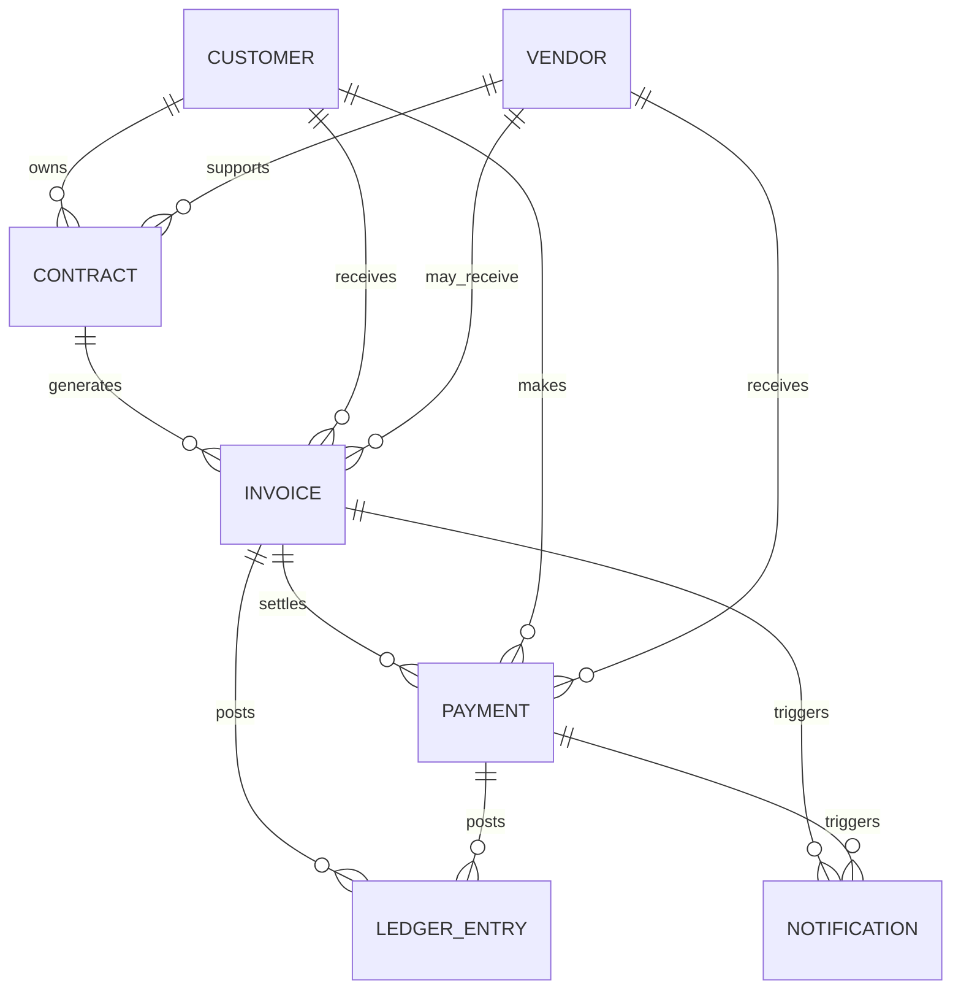

# API contract baseline

## Summary

All public endpoints use versioned REST routes under `/v1`, typed request and response models, consistent Problem Details errors, and bounded list queries.

Commands follow CQRS and DDD boundaries. Contract, Payment, and Ledger command handlers append domain events to event-sourced aggregates. Query endpoints read projections and may be eventually consistent. Customer, Vendor, Invoice, and Notification use state-based command persistence with domain events and outbox records.

## Resource routes

Each resource starts with:

```text
POST   /v1/{resources}
GET    /v1/{resources}
GET    /v1/{resources}/{id}
PUT    /v1/{resources}/{id}
DELETE /v1/{resources}/{id}
```

Resources are customers, vendors, contracts, invoices, payments, ledger entries, and notifications. Ledger entries and notifications have specialized read or command contracts because they are append-only or workflow records.

The initial API surface contains seven bounded-context services:

| API | Owns | Persistence |
|---|---|---|
| Customer API | Identity, profile, KYC, contact, billing, and tax profile | PostgreSQL |
| Vendor API | Vendor onboarding, bank verification, compliance, and AP workflow | SQL Server |
| Contract API | Commercial terms, pricing, billing rules, renewal, cancellation, discounts, and usage rules | PostgreSQL |
| Invoice API | Invoice generation, numbering, delivery, reconciliation, and invoice state | SQL Server |
| Payment API | Payment initiation, settlement, refunds, disputes, ledger synchronization, idempotency, and immutable payment records | PostgreSQL |
| Ledger API | Immutable double-entry ledger, balances, reconciliation, and audit trails | PostgreSQL |
| Notification API | Email, SMS, push delivery requests, provider adapters, delivery status, and retries | PostgreSQL |

## Service boundaries

Customer owns customers but does not own contracts, invoices, or payments. Vendor owns vendors and AP data but does not own contracts, invoices, or payments. Contract is the commercial root and stores `customerId` and optional `vendorId` references. Invoice belongs to a contract and customer, with an optional vendor reference for AP. Payment belongs to an invoice and customer or vendor.

Usage Metering remains a future bounded context. Ledger and Notification are initial services with independent databases and event consumers.

### Ownership relationship diagram



## Core resources

### Contract

```json
{
  "id": "contract_789",
  "customerId": "cust_123",
  "vendorId": null,
  "billingCycle": "monthly",
  "currency": "USD",
  "lineItems": [
    { "name": "Subscription", "unitPrice": 100, "quantity": 1 }
  ],
  "status": "active"
}
```

Contract status transitions are `draft -> active -> cancelled` or `draft -> cancelled`. Renewal appends a new contract version or renewal-period event without mutating issued invoices or completed payments. The Contract aggregate version provides optimistic concurrency.

### Invoice

```json
{
  "id": "inv_001",
  "contractId": "contract_789",
  "customerId": "cust_123",
  "amountDue": 100,
  "dueDate": "2026-10-01",
  "status": "issued"
}
```

Invoices become immutable after issuance. The state machine is `draft -> issued -> partially_paid -> paid`, with `issued -> overdue` and `issued -> void` where allowed.

### Payment

```json
{
  "id": "pay_001",
  "invoiceId": "inv_001",
  "amount": 100,
  "method": "card",
  "status": "completed"
}
```

Payments are immutable financial records. Create requests require an idempotency key. Refunds and disputes append new related events and never rewrite the original payment stream. Ledger entries are owned exclusively by Ledger API and are appended through Ledger commands or payment integration events.

## Initial endpoint contracts

```text
Customer:
POST   /v1/customers
GET    /v1/customers
GET    /v1/customers/{customerId}
PATCH  /v1/customers/{customerId}
DELETE /v1/customers/{customerId}

Vendor:
POST   /v1/vendors
GET    /v1/vendors
GET    /v1/vendors/{vendorId}
PATCH  /v1/vendors/{vendorId}
DELETE /v1/vendors/{vendorId}

Contract:
POST /v1/contracts
GET  /v1/contracts
GET  /v1/contracts/{contractId}
PATCH /v1/contracts/{contractId}
POST /v1/contracts/{contractId}/activate
POST /v1/contracts/{contractId}/cancel
POST /v1/contracts/{contractId}/renew
POST /v1/contracts/{contractId}/invoices

Invoice:
GET  /v1/invoices
GET  /v1/invoices/{invoiceId}
POST /v1/invoices/{invoiceId}/send
POST /v1/invoices/{invoiceId}/void

Payment:
POST /v1/payments
GET  /v1/payments
GET  /v1/payments/{paymentId}
POST /v1/payments/{paymentId}/refund

Ledger:
GET /v1/ledger/entries
GET /v1/ledger/balances

Notification:
POST /v1/notifications
GET  /v1/notifications/{notificationId}
POST /v1/notifications/{notificationId}/retry
```

## Command rules

- `POST` creates a resource and returns `201 Created`.
- `PUT` is an idempotent upsert where the resource contract supports it.
- `DELETE` performs a soft delete and returns `204 No Content` when successful.
- Deleted resources are excluded by default.
- Commands support an idempotency key where retries can repeat a write.
- Updates use optimistic concurrency and return `409 Conflict` for stale versions.
- Immutable identifiers, tenant ownership, audit fields, and status transitions are enforced by the application layer.

## List rules

Supported query parameters are explicitly documented per resource:

```text
page=1
pageSize=25
sort=-createdAt
search=term
status=active
createdFrom=2026-01-01
createdTo=2026-12-31
fields=id,name,status
```

Unknown fields, unsupported sort keys, invalid dates, and page sizes above `100` return `400`.

List responses use:

```json
{
  "items": [],
  "page": 1,
  "pageSize": 25,
  "totalCount": 0,
  "hasNextPage": false
}
```

## Errors

Use RFC 9457-compatible Problem Details with a stable application error code:

```json
{
  "type": "https://api.example.com/problems/validation-error",
  "title": "Validation failed",
  "status": 400,
  "code": "validation_error",
  "traceId": "00-...",
  "errors": {
    "name": ["Name is required."]
  }
}
```

Common responses:

| Status | Use |
|---:|---|
| 400 | Invalid input or query |
| 401 | Missing or invalid token |
| 403 | Authenticated but not authorized |
| 404 | Active resource does not exist |
| 409 | Concurrency or state conflict |
| 429 | Rate limit exceeded |
| 500 | Unexpected server failure without internal details |
