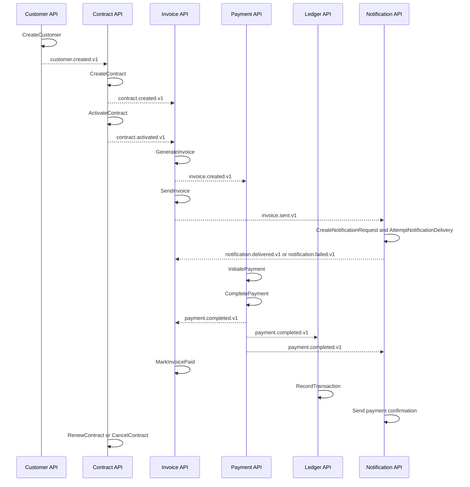

# Command and event catalog

This catalog defines the command, domain-event, projection, and integration-event boundaries for the seven initial services.

Commands enter through the owning service. Domain events remain internal to that bounded context. Only approved integration events cross service boundaries through the transactional outbox and RabbitMQ.

Public integration event names use lowercase dot notation with an explicit version, such as `contract.activated.v1`.

## Customer service

Persistence: state-based PostgreSQL model.

### Commands

- `CreateCustomer`
- `UpdateCustomerProfile`
- `UpdateBillingAddress`
- `UpdateTaxProfile`
- `DeactivateCustomer`

### Domain events

- `CustomerCreated`
- `CustomerUpdated`
- `CustomerDeactivated`

### Integration events

- `customer.created.v1`
- `customer.updated.v1`
- `customer.deactivated.v1`

Contract API consumes customer reference events. Customer API does not create or update contracts.

## Vendor service

Persistence: state-based SQL Server model.

### Commands

- `CreateVendor`
- `UpdateVendorProfile`
- `AddVendorBankAccount`
- `VerifyVendorBankAccount`
- `DeactivateVendor`

### Domain events

- `VendorCreated`
- `VendorUpdated`
- `VendorBankAccountAdded`
- `VendorBankAccountVerified`
- `VendorDeactivated`

### Integration events

- `vendor.created.v1`
- `vendor.updated.v1`
- `vendor.bank-account-verified.v1`
- `vendor.deactivated.v1`

Bank-account commands require encrypted persistence and explicit authorization. Plaintext account and routing numbers must not appear in events or logs.

## Contract service

Persistence: event-sourced PostgreSQL model with snapshots, projections, and outbox.

### Commands

- `CreateContract`
- `AddContractLineItem`
- `UpdateContractTerms`
- `ActivateContract`
- `CancelContract`
- `RenewContract`
- `RecordUsage`, when usage-based billing is enabled

Commands use an expected aggregate version. Contract lifecycle commands must enforce valid transitions and tenant ownership.

### Domain events

- `ContractCreated`
- `ContractLineItemAdded`
- `ContractTermsUpdated`
- `ContractActivated`
- `ContractCancelled`
- `ContractRenewed`
- `UsageRecorded`

### Projections

- `ContractProjectionUpdated`
- `ContractLineItemProjectionUpdated`

Projection records are rebuildable and are never the source of truth.

### Integration events

- `contract.created.v1`
- `contract.activated.v1`
- `contract.updated.v1`
- `contract.cancelled.v1`
- `contract.renewed.v1`
- `usage.reported.v1`, when usage metering is enabled

## Invoice service

Persistence: state-based SQL Server model with immutable issued invoices and domain events.

### Commands

- `GenerateInvoice`
- `SendInvoice`
- `MarkInvoicePaid`, accepted only from a validated Payment integration event
- `VoidInvoice`

### Domain events

- `InvoiceGenerated`
- `InvoiceSent`
- `InvoicePaid`
- `InvoiceVoided`

After issuance, invoice financial fields and line items cannot be updated. Payment status is derived from validated payment events and does not rewrite the original invoice document.

### Integration events

- `invoice.created.v1`
- `invoice.sent.v1`
- `invoice.paid.v1`
- `invoice.voided.v1`

## Payment service

Persistence: event-sourced PostgreSQL model with projections, idempotency, and outbox.

### Commands

- `InitiatePayment`
- `CompletePayment`
- `FailPayment`
- `RefundPayment`

Payment commands require `idempotencyKey`, `paymentId`, tenant context, and the expected aggregate version where applicable.

### Domain events

- `PaymentInitiated`
- `PaymentCompleted`
- `PaymentFailed`
- `PaymentRefundInitiated`
- `PaymentRefundCompleted`

### Projections

- `PaymentProjectionUpdated`
- `PaymentRefundProjectionUpdated`

### Integration events

- `payment.completed.v1`
- `payment.failed.v1`
- `payment.refunded.v1`

Payment events are immutable. Refunds append new events and never change the original payment event stream.

## Ledger service

Persistence: event-sourced PostgreSQL model with double-entry projections.

### Commands

- `RecordTransaction`
- `RecordDebit`
- `RecordCredit`
- `CloseAccountingPeriod`

The preferred application operation is `RecordTransaction`, which validates and records a complete balanced transaction. `RecordDebit` and `RecordCredit` are internal aggregate operations and must not permit an externally visible unbalanced transaction.

### Domain events

- `TransactionRecorded`
- `DebitRecorded`
- `CreditRecorded`
- `AccountingPeriodClosed`

### Projections

- `LedgerEntryProjectionUpdated`
- `LedgerBalanceProjectionUpdated`

Every posted transaction must contain at least one debit and one credit, use the same currency, and balance exactly. Ledger events are immutable. Corrections use reversal or compensating transactions.

## Notification service

Persistence: state-based PostgreSQL workflow with attempts and outbox.

### Commands

- `CreateNotificationRequest`
- `AttemptNotificationDelivery`
- `MarkNotificationSent`
- `MarkNotificationFailed`

### Domain events

- `NotificationRequested`
- `NotificationAttempted`
- `NotificationSent`
- `NotificationFailed`

### Consumed integration events

- `invoice.sent.v1`
- `payment.completed.v1`

Notification creates a delivery request from the consumed event. It owns provider attempts and retry state. It does not emit `invoice.sent.v1`; Invoice API owns that integration event.

### Integration events

- `notification.delivered.v1`
- `notification.failed.v1`

## End-to-end billing flow

## Command and event rules

- Commands are intent messages and may be retried only when idempotency behavior is defined.
- Domain events are immutable facts from one bounded context.
- Integration events are stable, versioned contracts and must not expose internal event-store payloads.
- Event handlers must persist deduplication state before acknowledging a message.
- Outbox records are written in the same transaction as the command-side state or event-store append.
- Consumers must tolerate duplicate and out-of-order delivery where the contract permits it.
- Financial corrections append compensating events or transactions instead of editing history.
