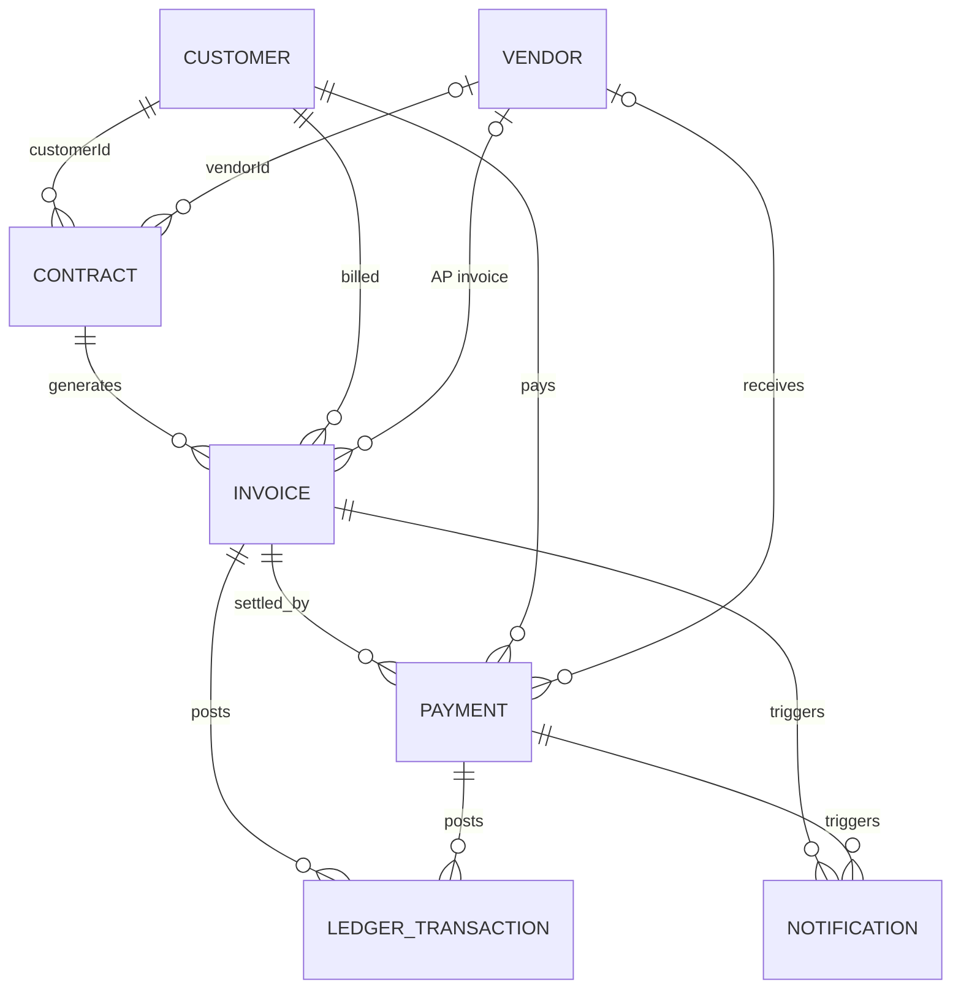
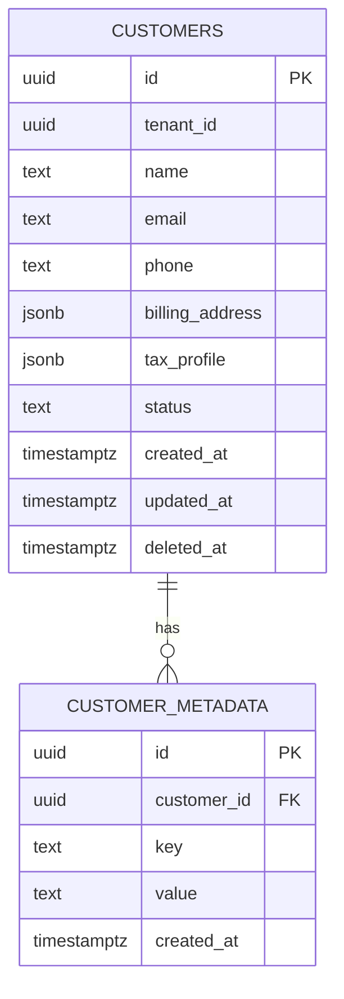
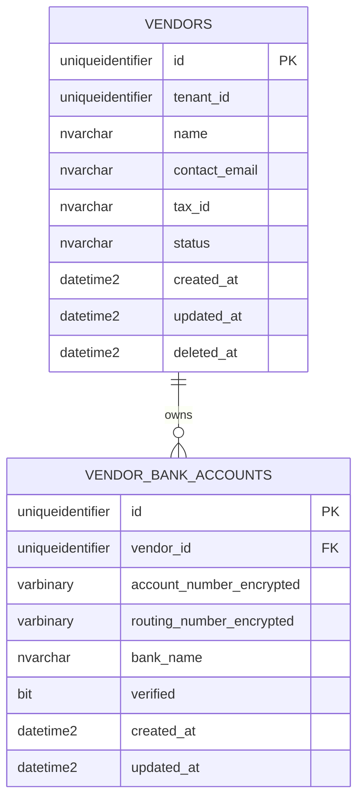
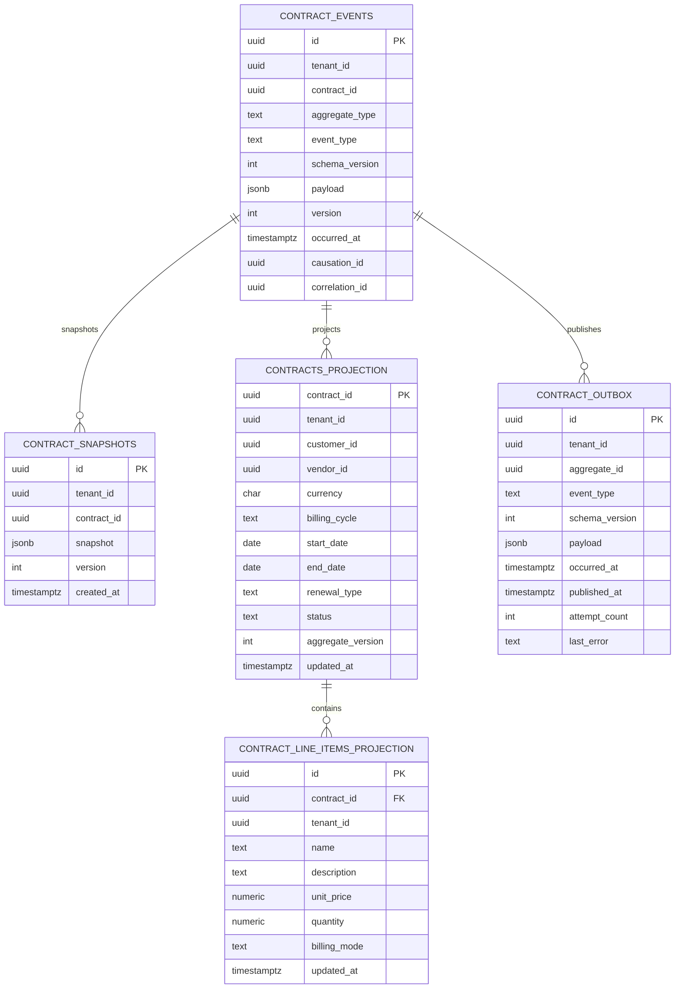
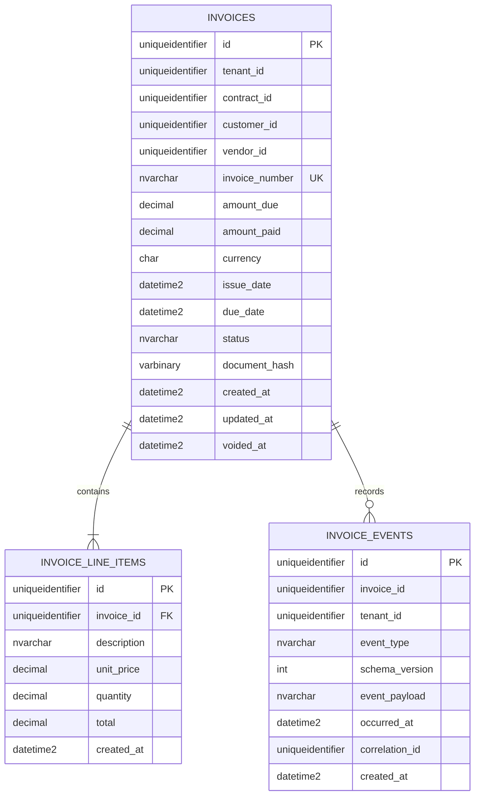
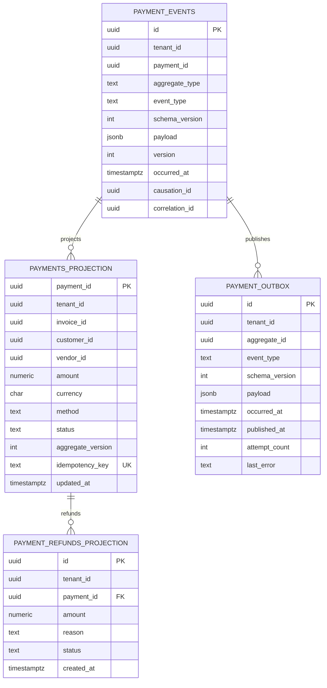
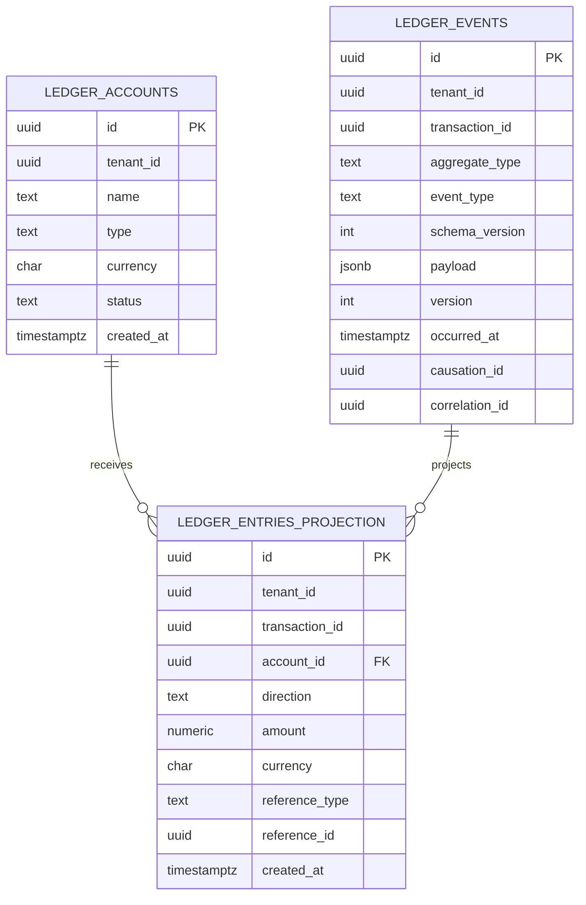
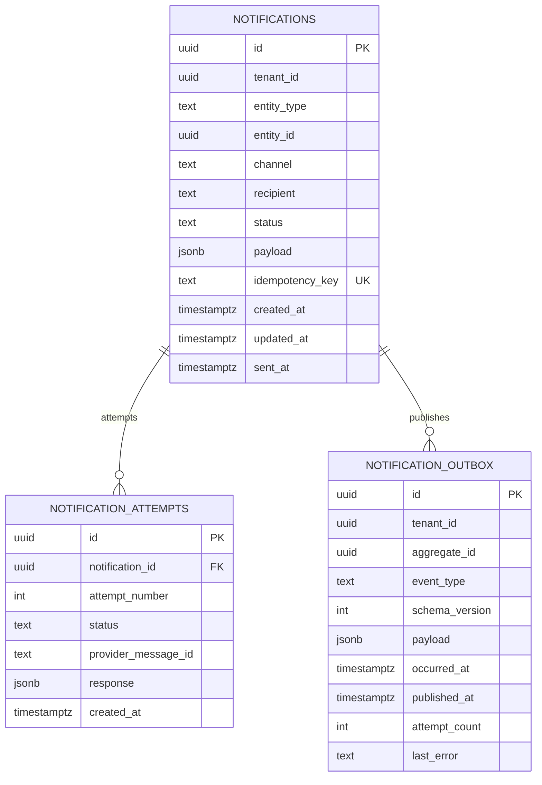

# Entity relationship model

This document defines the logical relationships between the seven initial services and the physical relationships inside each service database.

Each service owns its database. Relationships between services use identifiers and versioned integration events. They are not implemented as cross-database foreign keys or shared tables.

## Domain relationship model

Contract is the root commercial object. Customer and Vendor are reference subjects for a contract. Contract produces invoices. Payments settle invoices. Ledger records accounting facts from invoices and payments. Notification records delivery work triggered by invoice and payment events.

The diagram is logical. `customerId`, `vendorId`, `contractId`, `invoiceId`, and `paymentId` are validated through APIs, projections, and events. They are not cross-service database constraints.

## Service database ownership

| Service | Database | Primary model | Migration |
|---|---|---|---|
| Customer | PostgreSQL | State-based | Liquibase |
| Vendor | SQL Server | State-based | Alembic with SQLAlchemy |
| Contract | PostgreSQL | Event sourced with projections | Liquibase |
| Invoice | SQL Server | State-based with immutable issued documents | EF Core |
| Payment | PostgreSQL | Event sourced with projections | Liquibase |
| Ledger | PostgreSQL | Event sourced with double-entry projections | Liquibase |
| Notification | PostgreSQL | State-based delivery workflow | Liquibase |

## Customer database

Customer owns identity, contact, billing, tax, and KYC profile data. It does not store contracts, invoices, or payments.

## Vendor database

Bank and routing numbers are encrypted before persistence. Encryption keys are supplied by environment-specific secret management.

## Contract database

Contract is event sourced. `CONTRACT_EVENTS` is the source of truth. Snapshots and projections can be deleted and rebuilt.

`(contract_id, version)` is unique in the event stream. `customer_id` and `vendor_id` are logical references to Customer and Vendor services.

## Invoice database

Issued invoice values and line items are immutable. Payment status is a derived value updated from payment events.

`(tenant_id, invoice_number)` is unique. `contract_id`, `customer_id`, and `vendor_id` are logical references to other service databases.

## Payment database

Payment is event sourced. The original payment stream is never rewritten. Refunds and disputes append new events and create related projection records.

`(payment_id, version)` is unique in the event stream. `(tenant_id, idempotency_key)` is unique for payment commands.

## Ledger database

Ledger is event sourced and uses one row per posting. A transaction must balance debits and credits.

Valid account types are `asset`, `liability`, `equity`, `revenue`, and `expense`. Valid directions are `debit` and `credit`. `reference_id` points logically to an invoice or payment.

## Notification database

Notification owns delivery workflow state and provider attempts. It does not own customer identity or payment state.

Add a unique constraint on `(notification_id, attempt_number)`. Provider credentials and access tokens must not be stored in notification payloads or attempt responses.

## Relationship and integrity rules

- A service may use foreign keys only within its own database.
- Cross-service IDs are validated through commands, projections, or event consumers.
- Event-sourced aggregates enforce a unique `(aggregate_id, version)` sequence.
- State-based aggregates use optimistic concurrency or a row version.
- Outbox publication occurs in the same transaction as the owning state or event-store write.
- Consumers persist `event_id` in an inbox or consumer-specific deduplication table.
- Projections include the source event position and can be rebuilt.
- Ledger postings must balance within each transaction and currency.
- Financial records are corrected with compensating events, not destructive updates.
- Monetary columns use `numeric(19,4)` or `decimal(19,4)`. Quantities may use a separate higher-precision numeric type.
- Tenant identifiers are required on all tenant-scoped records and indexes.
