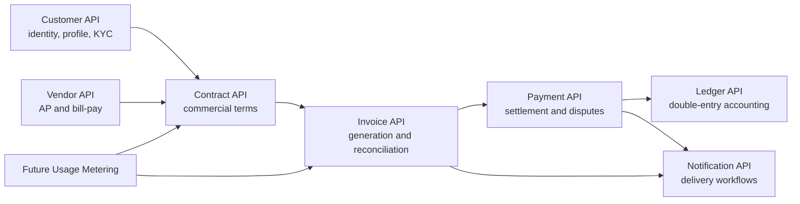
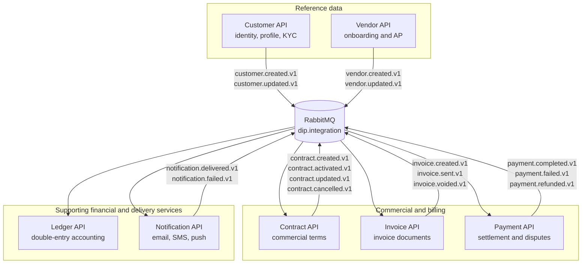
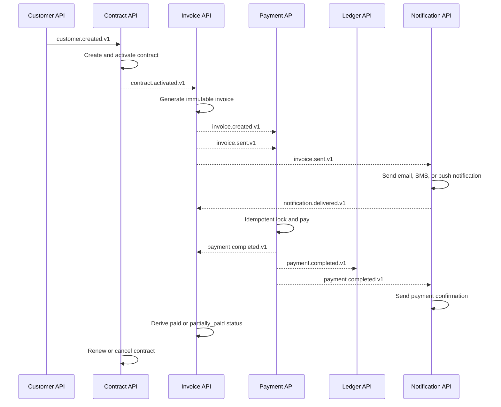
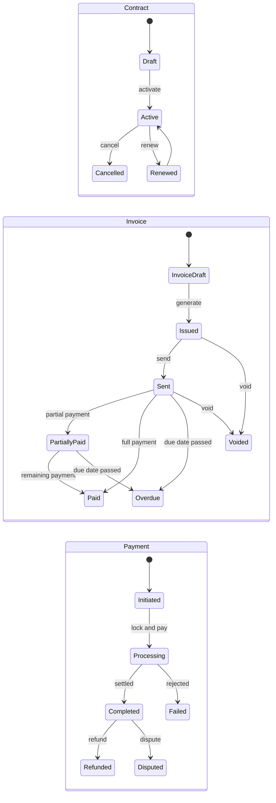
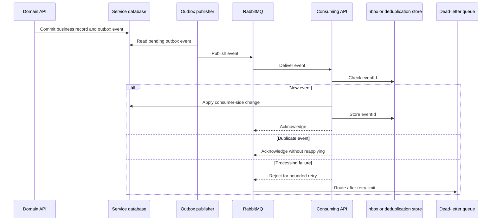

# Event contracts and readiness

## Summary

RabbitMQ is the selected broker for local development, CI, and the initial shared environment. The seven initial domain services publish versioned integration events through transactional outboxes and consume them idempotently. Contract, Payment, and Ledger use event-sourced write models with projections for reads.



## Microservice boundaries

| Service | Owns | Does not own |
|---|---|---|
| Customer API | Identity, contact, billing address, tax profile, KYC | Contracts, invoices, payments |
| Vendor API | Vendor onboarding, bank verification, compliance, AP approval and invoice intake | Contracts, invoices, payments |
| Contract API | Pricing, terms, billing cycle, payment obligations, renewal, cancellation, discounts, usage rules | Customer profile, invoice documents, payment settlement |
| Invoice API | Invoice generation, numbering, document delivery, reconciliation, invoice state | Contract terms, payment execution |
| Payment API | Initiation, two-phase payment coordination, settlement, refunds, disputes, immutable records, and ledger synchronization | Invoice terms, ledger entries, and customer profile |
| Ledger API | Double-entry postings, balances, reconciliation, and audit trails | Customer profiles, contract terms, invoice ownership, payment execution |
| Notification API | Notification requests, provider adapters, delivery attempts, status, retries, and idempotency | Customer identity, contract terms, invoice state, payment settlement |

Usage Metering is a future service. Ledger and Notification are initial services so accounting and delivery responsibilities remain outside the domain APIs that produce their events.

### Service ownership and event topology



## RabbitMQ conventions

| Item | Convention |
|---|---|
| Exchange | `dip.integration` |
| Event type | `{resource}.{verb}.v{version}` |
| Routing key | Same as event type |
| Retry | Delayed retry queues with bounded exponential backoff |
| Failure | Dead-letter exchange and queue |
| Delivery | At least once |
| Consumer identity | `{service}.{event-type}` |
| Deduplication | Persist `eventId` in an inbox or consumer table |

Event envelopes include:

```json
{
  "eventType": "contract.activated.v1",
  "eventId": "uuid",
  "occurredAt": "2026-09-24T22:00:00Z",
  "tenantId": "uuid",
  "producer": "contract-api",
  "schemaVersion": 1,
  "data": {}
}
```

Events contain identifiers and the minimum data required by consumers. They must not contain access tokens, card numbers, security codes, passwords, or unnecessary personal data.

## Event-sourced domain model

Contract, Payment, and Ledger keep immutable domain event streams in their own PostgreSQL databases. Each stream is identified by aggregate ID and includes a monotonically increasing sequence number. Commands use expected-version checks to prevent lost updates. Snapshots may speed rehydration, but projections and snapshots can be deleted and rebuilt from the event stream.

Customer, Vendor, Invoice, and Notification use state-based command persistence with domain events and transactional outbox records. Their state tables are not shared with other services.

Internal event streams and public integration events are separate contracts:

```text
Command -> Aggregate rehydration -> Domain events -> Event store
                                               -> Projection
                                               -> Outbox -> RabbitMQ integration event
```

## Initial event catalog

| Event | Producer | Consumers |
|---|---|---|
| `customer.created.v1` | Customer API | Contract API |
| `customer.updated.v1` | Customer API | Contract API |
| `customer.deactivated.v1` | Customer API | Contract API |
| `vendor.created.v1` | Vendor API | Contract API |
| `vendor.updated.v1` | Vendor API | Contract API |
| `vendor.bank-account-verified.v1` | Vendor API | Contract API |
| `vendor.deactivated.v1` | Vendor API | Contract API |
| `contract.created.v1` | Contract API | Invoice API |
| `contract.activated.v1` | Contract API | Invoice API |
| `contract.updated.v1` | Contract API | Invoice API |
| `contract.cancelled.v1` | Contract API | Invoice API |
| `contract.renewed.v1` | Contract API | Invoice API |
| `invoice.created.v1` | Invoice API | Payment API, Ledger API, Notification API |
| `invoice.sent.v1` | Invoice API | Payment API, Notification API |
| `invoice.voided.v1` | Invoice API | Ledger API |
| `invoice.paid.v1` | Invoice API | Ledger API, Notification API |
| `payment.completed.v1` | Payment API | Invoice API, Ledger API, Notification API |
| `payment.failed.v1` | Payment API | Invoice API, Notification API |
| `payment.refunded.v1` | Payment API | Invoice API, Ledger API, Notification API |
| `notification.delivered.v1` | Notification API | Invoice API, audit consumers |
| `notification.failed.v1` | Notification API | Invoice API, retry and operations consumers |
| `usage.reported.v1` | future Usage Metering | Contract API, Invoice API |

## Contract-driven billing workflow

1. Customer API creates a customer and publishes `customer.created.v1`.
2. Contract API validates the customer or vendor reference, stores commercial terms, and publishes `contract.created.v1`.
3. Contract API activates the contract and publishes `contract.activated.v1`.
4. Invoice API schedules or accepts invoice generation for a billing cycle, usage event, or manual command.
5. Invoice API creates an immutable invoice and publishes `invoice.created.v1`.
6. Invoice API marks the invoice as ready for delivery and publishes `invoice.sent.v1`. Notification API consumes the event, sends email, SMS, or push notifications, and publishes delivery outcome events.
7. Payment API consumes the invoice events, accepts an idempotent payment command, coordinates lock and pay processing, and publishes `payment.completed.v1`, `payment.failed.v1`, or `payment.refunded.v1`.
8. Invoice API updates derived payment status to `partially_paid`, `paid`, or `overdue` without mutating the original invoice document.
9. Ledger API records double-entry entries from invoice, payment, refund, and void events.
10. Contract API renews the contract or processes cancellation. Renewal starts the next billing period and can cause Invoice API to generate the next invoice.



### Invoice and payment state transitions



### Reliable event delivery



## Readiness checklist

- [x] External broker model selected. APIs validate tokens only.
- [x] Keycloak selected for local, CI, and initial shared development.
- [ ] Microsoft Entra External ID deferred until an Azure tenant is available.
- [x] RabbitMQ selected for local, CI, and initial shared environments.
- [x] Seven initial service boundaries and database ownership defined.
- [x] Contract selected as the root commercial object.
- [x] PostgreSQL selected for Contract with Liquibase migrations.
- [x] Initial API routes, resource states, event catalog, and billing workflow defined.
- [x] Local notification adapter defined as an email adapter with provider-neutral configuration.
- [ ] Select the deployable hosting provider after free-tier testing.

The initial implementation includes Ledger and Notification APIs. Usage Metering remains deferred, with its event contract reserved so it can be introduced without changing ownership of Customer, Vendor, Contract, Invoice, Payment, Ledger, or Notification data.
