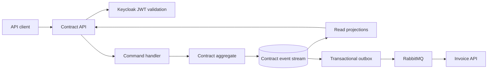

# Contract API

Contract API owns the commercial agreement between a customer and an optional vendor. It manages pricing, line items, billing cycles,
payment obligations, renewals, cancellations, discounts, and usage rules. Contract is the root commercial object for the platform.

## Technology and design

| Area | Choice |
|---|---|
| Runtime | .NET 10 and ASP.NET Core minimal APIs |
| Persistence | PostgreSQL owned by Contract API |
| Migrations | Liquibase in `migrations/liquibase/contract` |
| Architecture | DDD, CQRS, event sourcing, projections, snapshots, and transactional outbox |
| Integration | RabbitMQ with versioned `contract.*.v1` events |
| Security | Keycloak JWT validation, tenant scope, role and ownership policies |
| Shared foundation | `src/BuildingBlocks` |
| Observability | OpenTelemetry, correlation IDs, health checks, structured logging, Problem Details |

Commands append immutable domain events with an expected aggregate version. Queries read rebuildable projections. Customer and vendor
identifiers are validated through APIs and integration events rather than cross-database joins.

## Architecture



The current Phase 0 implementation exposes foundation and health endpoints. Contract lifecycle commands, projections, and event consumers
are Phase 1 work.

## Local build and run

```powershell
dotnet build DistributedIntegrationPlatform.slnx --configuration Release
dotnet run --project src\ContractApi\ContractApi.csproj
```

For PostgreSQL, RabbitMQ, Keycloak, and all .NET services:

```powershell
dotnet run --project src\AppHost\AppHost.csproj
```

Apply or validate the Contract Liquibase project through the repository migration workflow. Keep database credentials in environment
variables or secret storage.

## Tests and CI

```powershell
dotnet test DistributedIntegrationPlatform.slnx --configuration Release
python scripts\validate_migrations.py
```

CI builds the solution, runs unit tests, validates the Contract Liquibase structure, audits dependencies, and builds containers. Later
Contract work must add aggregate, concurrency, projection rebuild, authorization, and event contract tests.
