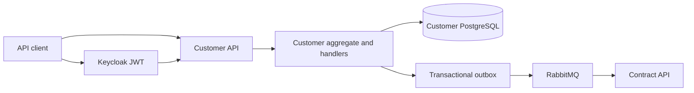

# Customer API

Customer API owns customer identity, contact details, billing addresses, tax profiles, and KYC data. It does not own contracts, invoices,
payments, or ledger records. Customer changes are published as versioned integration events for consumers such as Contract API.

## Technology and design

| Area | Choice |
|---|---|
| Runtime | .NET 10 and ASP.NET Core minimal APIs |
| Persistence | PostgreSQL owned by Customer API |
| Migrations | Liquibase in `migrations/liquibase/customer` |
| Shared foundation | `src/BuildingBlocks` |
| Architecture | DDD bounded context, CQRS, state-based aggregate persistence |
| Integration | RabbitMQ and transactional outbox events |
| Security | Keycloak-issued JWT bearer tokens, tenant and role policies |
| Observability | OpenTelemetry, correlation IDs, health checks, structured logging, Problem Details |

The service uses DTOs at the API boundary, application handlers for commands and queries, and repositories for persistence. Cross-service
customer references are identifiers and events, not database foreign keys.

## Architecture



The current Phase 0 implementation exposes foundation and health endpoints. Customer CRUD and event handlers are Phase 1 work.

## Local build and run

From the repository root:

```powershell
dotnet build DistributedIntegrationPlatform.slnx --configuration Release
dotnet run --project src\CustomerApi\CustomerApi.csproj
```

Run the complete local resource graph with Aspire:

```powershell
dotnet run --project src\AppHost\AppHost.csproj
```

Set `Authentication__Authority` and `Authentication__Audience` through environment variables or local configuration. Do not commit
credentials or connection strings.

## Tests and CI

Run the solution tests and foundation checks:

```powershell
dotnet test DistributedIntegrationPlatform.slnx --configuration Release
python scripts\validate_migrations.py
python scripts\validate_ci.py
```

The `CI` workflow restores, builds, and tests the .NET solution, validates migrations, audits Python dependencies, and builds service
containers. The migration workflow validates Liquibase changelogs independently on pull requests.
