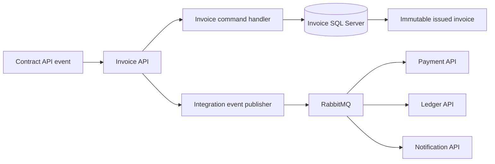

# Invoice API

Invoice API generates invoices from contract information, assigns invoice numbers, manages delivery and reconciliation, and tracks
invoice lifecycle state. Issued invoice financial values and line items are immutable. Payment status is derived from validated payment
events.

## Technology and design

| Area | Choice |
|---|---|
| Runtime | .NET 10 and ASP.NET Core minimal APIs |
| Persistence | SQL Server owned by Invoice API |
| Data access | Entity Framework Core 10 |
| Migrations | EF Core migration in `src/InvoiceApi/Migrations` |
| Architecture | DDD, CQRS, state-based aggregate persistence, immutable issued documents |
| Integration | RabbitMQ and invoice integration events |
| Security | Keycloak JWT validation, tenant and ownership policies |
| Shared foundation | `src/BuildingBlocks` |
| Observability | OpenTelemetry, correlation IDs, health checks, structured logging, Problem Details |

Invoice API owns invoice data only. Contract, customer, vendor, and payment relationships are logical references validated through APIs and
events. It must not query another service database.

## Architecture



The current Phase 0 implementation includes the EF Core context and foundation migration, plus health and foundation endpoints. Invoice
generation and lifecycle behavior are Phase 1 work.

## Local build and run

```powershell
dotnet build DistributedIntegrationPlatform.slnx --configuration Release
dotnet run --project src\InvoiceApi\InvoiceApi.csproj
```

Start the local SQL Server, RabbitMQ, Keycloak, and service resources through Aspire:

```powershell
dotnet run --project src\AppHost\AppHost.csproj
```

Use a local SQL Server connection string from environment configuration. Never commit it.

## Tests and CI

```powershell
dotnet test DistributedIntegrationPlatform.slnx --configuration Release
python scripts\validate_migrations.py
```

CI builds and tests Invoice API with the solution, validates the migration structure, audits dependencies, and builds its container.
Domain work should add tests for immutable issuance, numbering, reconciliation, payment status derivation, and concurrency.
