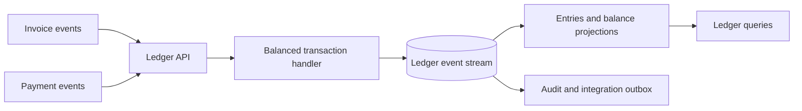

# Ledger API

Ledger API owns immutable double-entry accounting facts, balances, reconciliation, and accounting audit history. It records financial
effects from invoice, payment, refund, and void events. Payment API does not write ledger entries directly.

## Technology and design

| Area | Choice |
|---|---|
| Runtime | .NET 10 and ASP.NET Core minimal APIs |
| Persistence | PostgreSQL owned by Ledger API |
| Migrations | Liquibase in `migrations/liquibase/ledger` |
| Architecture | DDD, CQRS, event sourcing, projections, balanced transaction aggregate |
| Integration | RabbitMQ and versioned ledger events |
| Security | Keycloak JWT validation, tenant and role policies |
| Shared foundation | `src/BuildingBlocks` |
| Observability | OpenTelemetry, correlation IDs, health checks, structured logging, Problem Details |

Every posted transaction must contain debit and credit postings that balance in the same currency. Corrections use reversal or
compensating transactions. Ledger event streams and entries are never destructively edited.

## Architecture



The current Phase 0 implementation exposes foundation and health endpoints. Posting, balance, reconciliation, and event consumers are
Phase 1 work.

## Local build and run

```powershell
dotnet build DistributedIntegrationPlatform.slnx --configuration Release
dotnet run --project src\LedgerApi\LedgerApi.csproj
```

Use Aspire for the local PostgreSQL, RabbitMQ, Keycloak, and service resources:

```powershell
dotnet run --project src\AppHost\AppHost.csproj
```

## Tests and CI

```powershell
dotnet test DistributedIntegrationPlatform.slnx --configuration Release
python scripts\validate_migrations.py
```

CI builds and tests Ledger API, validates its Liquibase project, audits dependencies, and builds the container. Future tests must cover
balanced postings, currency rules, duplicate events, replayable projections, reversals, reconciliation, and authorization.
