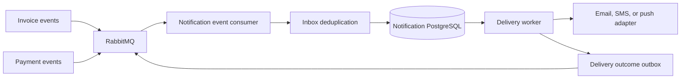

# Notification API

Notification API owns notification requests, provider adapters, delivery attempts, status transitions, retries, and notification
idempotency. It consumes invoice and payment integration events and does not own customer identity or payment state.

## Technology and design

| Area | Choice |
|---|---|
| Runtime | .NET 10 and ASP.NET Core minimal APIs |
| Persistence | PostgreSQL owned by Notification API |
| Migrations | Liquibase in `migrations/liquibase/notification` |
| Architecture | DDD, CQRS, state-based workflow, background delivery processing, transactional outbox |
| Integration | RabbitMQ with inbox deduplication and versioned delivery events |
| Security | Keycloak JWT validation, tenant and role policies |
| Shared foundation | `src/BuildingBlocks` |
| Observability | OpenTelemetry, correlation IDs, health checks, structured logging, Problem Details |

Provider credentials and access tokens are configuration secrets. They must not be stored in notification payloads, delivery responses,
logs, or event contracts.

## Architecture



The current Phase 0 implementation exposes foundation and health endpoints. Notification commands, background delivery, retries, and
provider adapters are Phase 1 work.

## Local build and run

```powershell
dotnet build DistributedIntegrationPlatform.slnx --configuration Release
dotnet run --project src\NotificationApi\NotificationApi.csproj
```

Run the local infrastructure and services with Aspire:

```powershell
dotnet run --project src\AppHost\AppHost.csproj
```

Configure provider-neutral notification settings through environment variables. Do not commit provider credentials.

## Tests and CI

```powershell
dotnet test DistributedIntegrationPlatform.slnx --configuration Release
python scripts\validate_migrations.py
```

CI builds and tests Notification API, validates its Liquibase project, audits dependencies, and builds the container. Future tests must
cover idempotent requests, retry limits, duplicate events, provider failures, delivery state transitions, and secret redaction.
