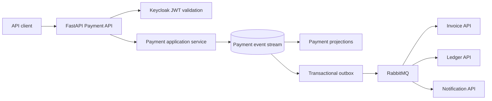

# Payment API

Payment API owns payment initiation, processing outcomes, refunds, disputes, idempotency, and immutable payment history. It publishes
payment outcomes for Invoice API, Ledger API, and Notification API.

The current implementation is the Python foundation in `src/PaymentApi/payment_api/main.py` with Pydantic configuration and JWT
validation.

## Technology and design

| Area | Choice |
|---|---|
| Runtime | Python 3.12 and FastAPI |
| Data access | SQLAlchemy, planned for the service implementation |
| Persistence | PostgreSQL owned by Payment API |
| Migrations | Liquibase in `migrations/liquibase/payment` |
| Architecture | DDD, CQRS-style application services, event sourcing, projections, outbox and inbox |
| Integration | RabbitMQ with versioned payment events |
| Security | Keycloak JWT validation with issuer, audience, expiry, tenant, and role checks |
| Configuration | Pydantic Settings and environment variables |
| Quality | Ruff, pytest, pip-audit |

Payment events are append-only. Refunds and disputes append related events instead of changing the original payment record. Payment
commands require idempotency keys and expected aggregate versions where applicable.

## Architecture



The current Python module exposes liveness and a protected foundation route. Payment commands, SQLAlchemy persistence, projections, and
event consumers are Phase 1 work.

## Documentation

Comprehensive guides for Python service development, file structure, and packaging:

- **[Python Services Documentation Index](../../docs/services/README.md)** - Overview and quick reference
- **[Python Service Architecture Guide](../../docs/services/PYTHON_SERVICE_ARCHITECTURE.md)** - File structure, purposes, design decisions
- **[Setuptools & Packaging Guide](../../docs/services/SETUPTOOLS_AND_PACKAGING.md)** - How Python packaging works

These guides explain:
- File structure and purposes (main.py, auth.py, config.py, pyproject.toml, etc.)
- How setuptools and pip install work
- Why foundation code is duplicated across services
- When to extract shared code
- Common development tasks

## Local build and run

From the repository root:

```powershell
# Install and run the service
cd src/PaymentApi
python -m pip install -e ".[dev]"
python -m uvicorn payment_api.main:app --reload

# Or use dotnet Aspire orchestration
cd ../..
dotnet run --project src/AppHost/AppHost.csproj
```

The service reads configuration from environment variables. The shared local identity authority defaults to the Keycloak development
realm, but JWT verification requires a configured public key or service authentication adapter.

See [Setuptools & Packaging Guide](../../docs/services/SETUPTOOLS_AND_PACKAGING.md) for detailed setup instructions.

## Tests and CI

```powershell
# From src/PaymentApi directory
python -m pytest tests
python -m ruff check .
pip-audit

# From repository root
python scripts/validate_migrations.py
```

CI runs Ruff, pytest, dependency auditing, migration validation, and the container build for all Python services. Future Payment tests must cover idempotency, expected-version conflicts, immutable event streams, refunds, disputes, duplicate delivery, and tenant authorization.

See [Python Service Architecture Guide](../../docs/services/PYTHON_SERVICE_ARCHITECTURE.md#development-workflow) for workflow details.
