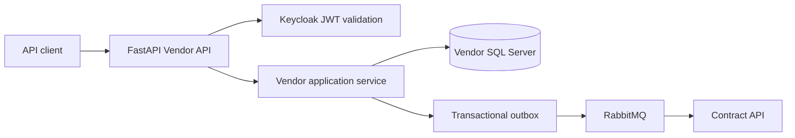

# Vendor API

Vendor API owns vendor onboarding, compliance, bank-account verification, accounts-payable approval, and invoice intake. It publishes
vendor reference events consumed by Contract API.

The current implementation is the Python foundation in `src/VendorApi/vendor_api/main.py` with Pydantic configuration and JWT
validation.

## Technology and design

| Area | Choice |
|---|---|
| Runtime | Python 3.12 and FastAPI |
| Data access | SQLAlchemy, planned for the service implementation |
| Persistence | SQL Server owned by Vendor API |
| Migrations | Alembic in `migrations/alembic/vendor` |
| Architecture | DDD bounded context, CQRS-style application services, state-based aggregates, transactional outbox |
| Integration | RabbitMQ with versioned vendor events |
| Security | Keycloak JWT validation, tenant scope, role and ownership policies |
| Configuration | Pydantic Settings and environment variables |
| Quality | Ruff, pytest, pip-audit |

Bank and routing numbers must be encrypted before persistence. They must not appear in logs, event payloads, API errors, or provider
responses. Vendor data is separate from Contract, Invoice, and Payment databases.

## Architecture



The current Python module exposes liveness and a protected foundation route. Vendor onboarding, encryption, SQLAlchemy repositories,
Alembic execution, and event consumers are Phase 1 work.

## Documentation

Comprehensive guides for Python service development, file structure, and packaging:

- **[Python Services Documentation Index](../../docs/services/README.md)** - Overview and quick reference
- **[Python Service Architecture Guide](../../docs/services/PYTHON_SERVICE_ARCHITECTURE.md)** - File structure, purposes, design decisions
- **[Setuptools & Packaging Guide](../../docs/services/SETUPTOOLS_AND_PACKAGING.md)** - How Python packaging works

These guides explain:
- File structure and purposes (main.py, auth.py, config.py, pyproject.toml, etc.)
- How setuptools and pip install work
- Why foundation code is duplicated across services
- When to extract shared code
- Common development tasks

## Local build and run

From the repository root:

```powershell
# Install and run the service
cd src/VendorApi
python -m pip install -e ".[dev]"
python -m uvicorn vendor_api.main:app --reload

# Or use dotnet Aspire orchestration
cd ../..
dotnet run --project src/AppHost/AppHost.csproj
```

Vendor SQL Server credentials and encryption-key configuration must come from environment-specific secret storage.

See [Setuptools & Packaging Guide](../../docs/services/SETUPTOOLS_AND_PACKAGING.md) for detailed setup instructions.

## Tests and CI

```powershell
# From src/VendorApi directory
python -m pytest tests
python -m ruff check .
pip-audit

# From repository root
python scripts/validate_migrations.py
```

CI runs Python checks, validates the Alembic and other migration structures, audits dependencies, and builds the Python container for all Python services. Future Vendor tests must cover encryption boundaries, onboarding state transitions, bank verification authorization, duplicate events, and tenant ownership.

See [Python Service Architecture Guide](../../docs/services/PYTHON_SERVICE_ARCHITECTURE.md#development-workflow) for workflow details.
